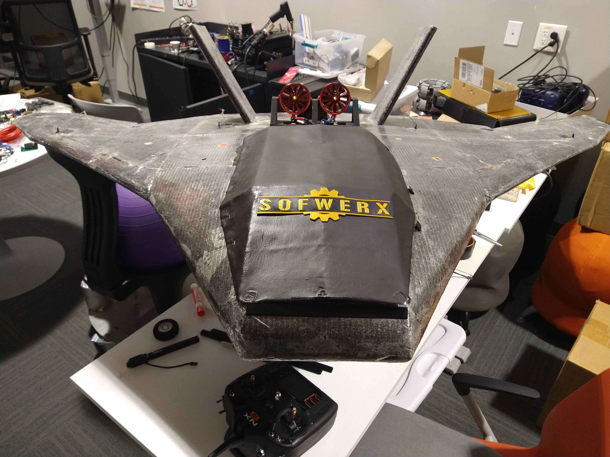
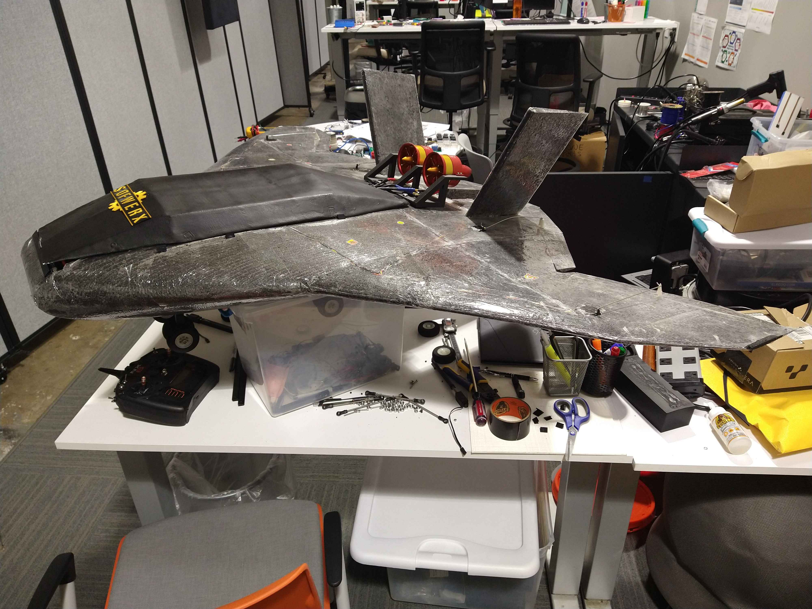
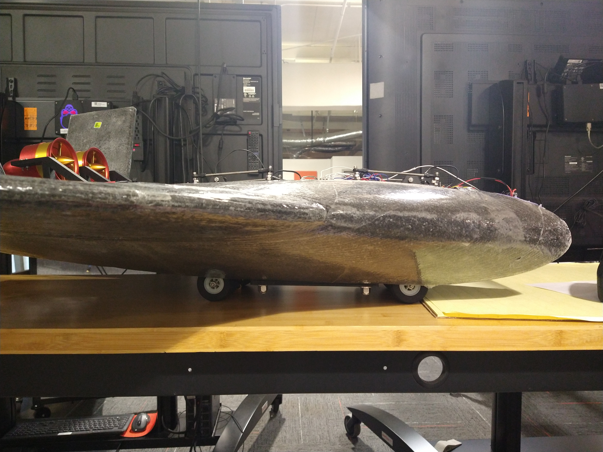
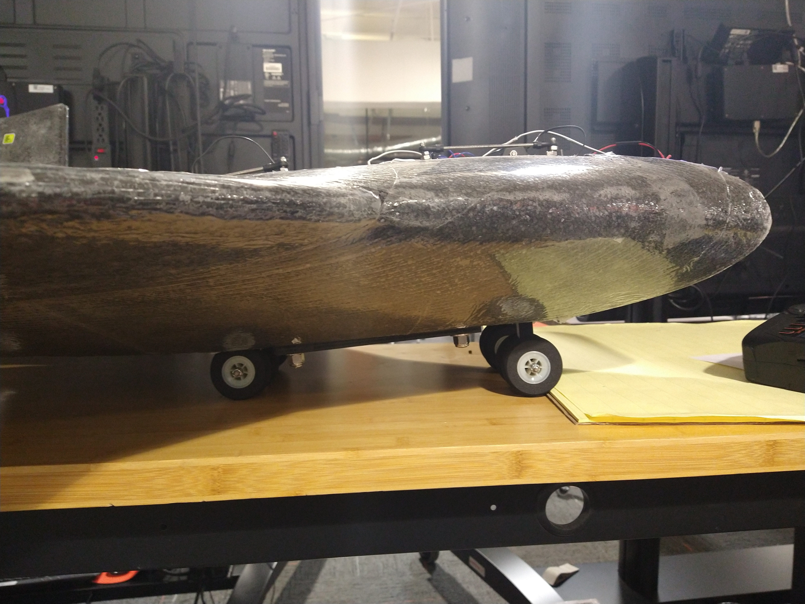
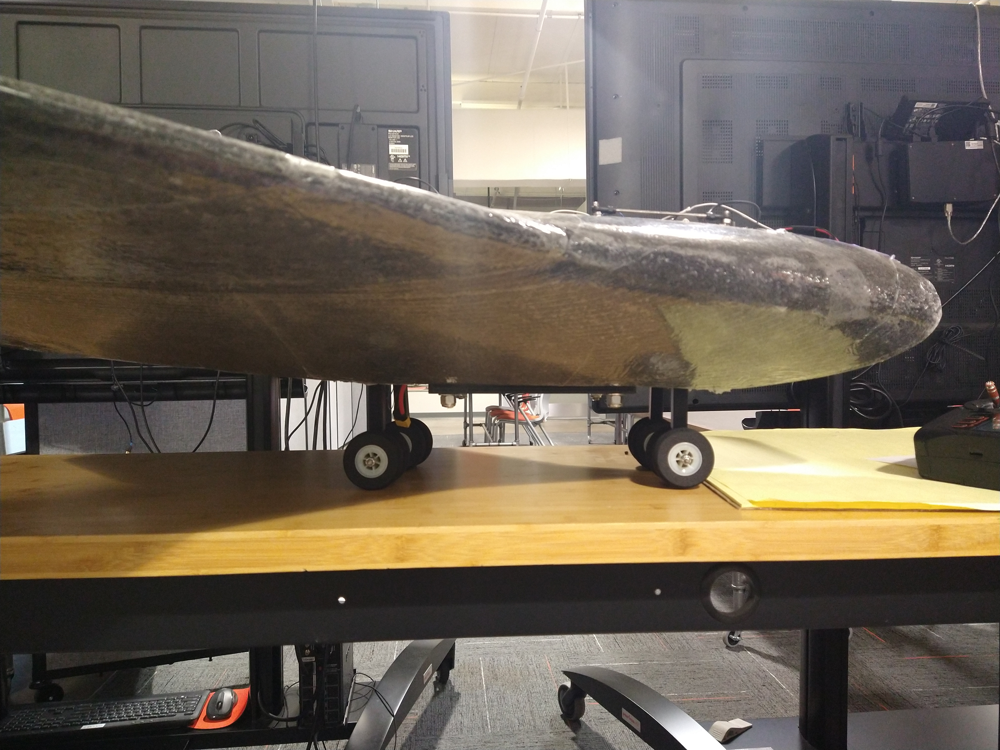
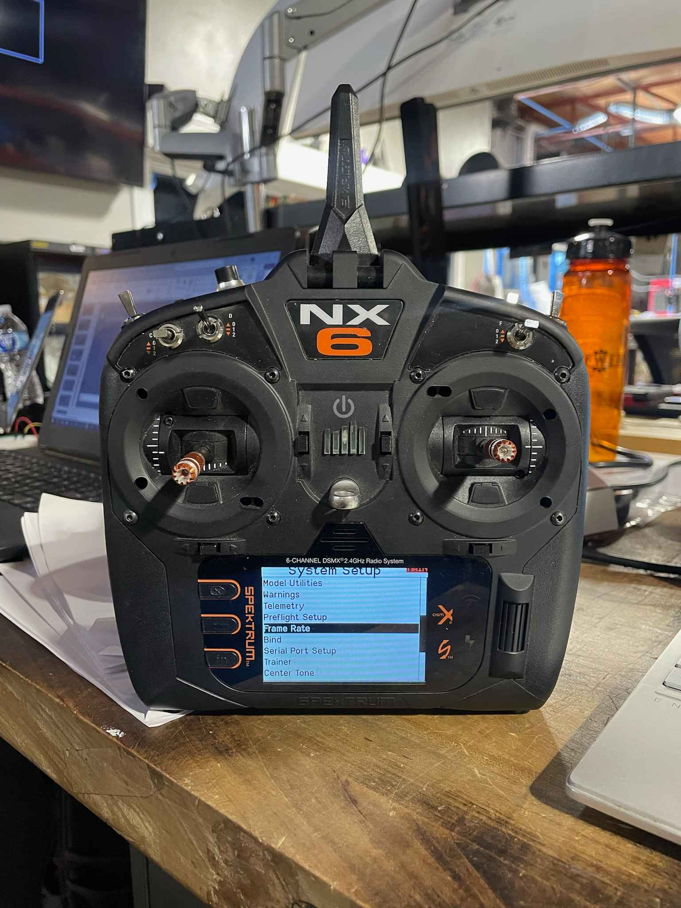

# Blended Body Aircraft
 A blended body aircraft that serves as the proof of concept for special landing gear that can rotate and elevate independently of one another. Rotation allows the plane to be parked in a hangar horizontally, which is more convenient than taking a multiple point turn to park.

  
  

We use the NX6 Controller to control the drone. This controller is made for use with hobby drones, and the corresponding receiver is attached to the plane. The receiver natively controls the aileron servos, and the servos and actuators for the landing gear are controlled via Arduino. For Arduino-managed components, the receiver values are sent to the Arduino, and we use those values to decide which mode to engage. For example, the frequency for the 'up' position of a double throw switch on the controller will extend the landing gear fully. The 'down' position on this switch will retract them fully.

  
  
  

  

Schematic available .

